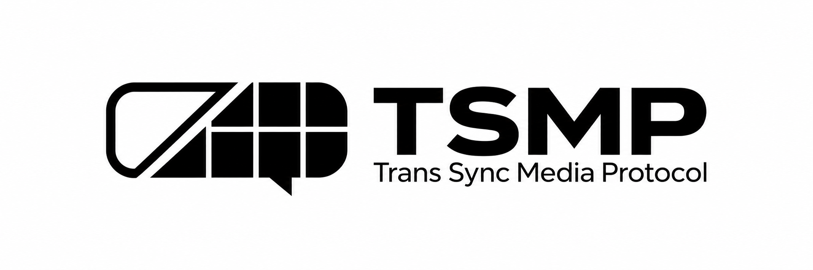

<p align="center">
  
</p>

<p align="center"><strong>VRChat の状態と動きを、テクスチャストリームで伝送。</strong></p>

<p align="center">
  <a href="https://github.com/kibalab/TSMP-Core/blob/main/LICENSE.md"></a>
  <a href="https://github.com/kibalab/TSMP-Core/actions/workflows/release.yml"></a>
  <a href="https://github.com/kibalab/TSMP-Core/releases/latest"></a>
  <a href="https://github.com/kibalab/TSMP-Core/releases"></a>
</p>

<p align="center">
  <a href="https://github.com/kibalab/TSMP-Core/blob/main/Packages/com.kibalab.tsmp.core/package.json"></a>
  <a href="https://github.com/kibalab/TSMP-Core/blob/main/Packages/com.kibalab.tsmp.core/package.json"></a>
  <a href="https://vpm.kiba.red/"></a>
  <a href="https://kibalab.github.io/TSMP-Core/"></a>
</p>

<p align="center">
  <a href="#インストール">はじめる</a> &nbsp;·&nbsp;
  <a href="https://kibalab.github.io/TSMP-Core/ja/">ドキュメント</a> &nbsp;·&nbsp;
  <a href="https://github.com/kibalab/TSMP-Core/releases">リリース</a> &nbsp;·&nbsp;
  <a href="https://github.com/kibalab/TSMP-Core/issues">問題を報告</a>
</p>

<p align="center">
  <a href="README.ko.md">한국어</a> &nbsp;·&nbsp; <a href="README.en.md">English</a> &nbsp;·&nbsp; <strong>日本語</strong>
</p>

---

## TSMP とは？

TSMP（Trans Sync Media Protocol）は、ランタイムデータをテクスチャストリームで送る通信プロトコルです。TSMP Core は、このプロトコルを VRChat ワールドで利用するためのランタイム・同期コンポーネント・設定ツールを提供するオープンソースのネットワークフレームワークです。

Encoder がシーンのデータをピクセルに変換し、キャプチャ・配信経路を経由した映像を Decoder が読み取り、対応する受信オブジェクトに適用します。

| 機能 | 内容 |
| --- | --- |
| **テクスチャ転送** | TSMP Encoder / Decoder によるランタイムデータのエンコード・デコード |
| **マルチインスタンス通信** | 外部のキャプチャ・配信経路と組み合わせ、異なる VRChat インスタンス間の同期ソリューションを構築 |
| **状態とイベント** | `[TransSync]` フィールド同期、`SendTransRPC(methodName, target)` による RPC |
| **動きと再生** | Transform、Rigidbody、Humanoid・VRChat Avatar Pose、BlendShape、Animator、Timeline |
| **シーン設定** | `TSMPSetup` の自動設定、コーデック検出・選択、コンポーネントとバインディングの自動更新 |
| **コーデック拡張** | カスタムコーデック用の共通ランタイム、shader include、catalog asset |

## インストール

**VRChat 環境:** Unity 2022.3 LTS · VRChat Worlds SDK 3.9.0 以降

1. VRChat Creator Companion に以下の VPM リポジトリを追加します。

   ```text
   https://vpm.kiba.red/
   ```

2. **TSMP Core** と **TSMP Codec Luma4** を一緒にインストールし、インポートが完了するまで待ちます。

Core はシーンランタイムとセットアップを、別のコーデックパッケージはピクセルエンコードを担当します。

<details>
<summary><strong>VRCSDK のない通常の Unity で使う場合</strong></summary>

- 通常の Unity 対応を含む Core と Luma4 のリビジョンを使用します。
- Unity Package Manager の **Add package from disk** で各パッケージの `package.json` を選択します。
- 下記と同じ Controller プレハブを使用します。コンポーネントとバインディングは自動準備されます。
- 検証済みの構成は Windows x64、Mono、managed stripping 無効です。リフレクション・stripping の制限と IL2CPP の検証範囲は[インストールガイド](https://kibalab.github.io/TSMP-Core/ja/docs/getting-started/installation)を参照してください。

</details>

## クイックスタート

1. [`TSMPController.prefab`](Packages/com.kibalab.tsmp.core/Samples/TSMPController.prefab) をシーンに配置します。
2. 同期したいオブジェクトに必要な `TSMPNetwork*` コンポーネントを追加します。
3. `TSMPSetup` で `Refresh Codecs` を押し、コーデックと入出力設定を確認します。コンポーネントとバインディングは自動更新されます。
4. Play Mode に入るか VRChat でテストし、共通 Controller の初期設定のローカルループバックでエンコード・デコードを確認します。
5. 外部転送では Encoder の出力 RenderTexture を配信し、受信した TSMP 映像を Decoder の入力テクスチャに接続します。

**生成リソース:** `Assets/TSMPGenerated` をシーンと一緒にバージョン管理してください。

[クイックスタートの詳細](https://kibalab.github.io/TSMP-Core/ja/docs/getting-started/quickstart) · [テクスチャ転送の設定](https://kibalab.github.io/TSMP-Core/ja/docs/guides/texture-transport)

## ガイド

| やりたいこと | ドキュメント |
| --- | --- |
| 最初のシーンをインストール・設定 | [インストール](https://kibalab.github.io/TSMP-Core/ja/docs/getting-started/installation) · [クイックスタート](https://kibalab.github.io/TSMP-Core/ja/docs/getting-started/quickstart) |
| 同期コンポーネントを使う | [Network components](https://kibalab.github.io/TSMP-Core/ja/docs/scripting-api/network-components) |
| カスタムコーデックを作る | [Custom codec](https://kibalab.github.io/TSMP-Core/ja/docs/developer/custom-codec) |
| 受信・デコードの問題を調べる | [Troubleshooting](https://kibalab.github.io/TSMP-Core/ja/docs/troubleshooting) |

## リリースと参加

[最新の正式リリース](https://github.com/kibalab/TSMP-Core/releases/latest) · [すべてのリリース](https://github.com/kibalab/TSMP-Core/releases)

リリースタグは `v0.x.y` 形式を使用します。1.0 より前は公開 API が変更される場合があります。

不具合や改善案は [Issues](https://github.com/kibalab/TSMP-Core/issues) にお寄せください。コード・ドキュメントへの貢献は[貢献ガイド](CONTRIBUTING.md)を参照してください。

---

[MIT License](LICENSE.md) · Copyright (c) 2026 KIBA_Labs.
